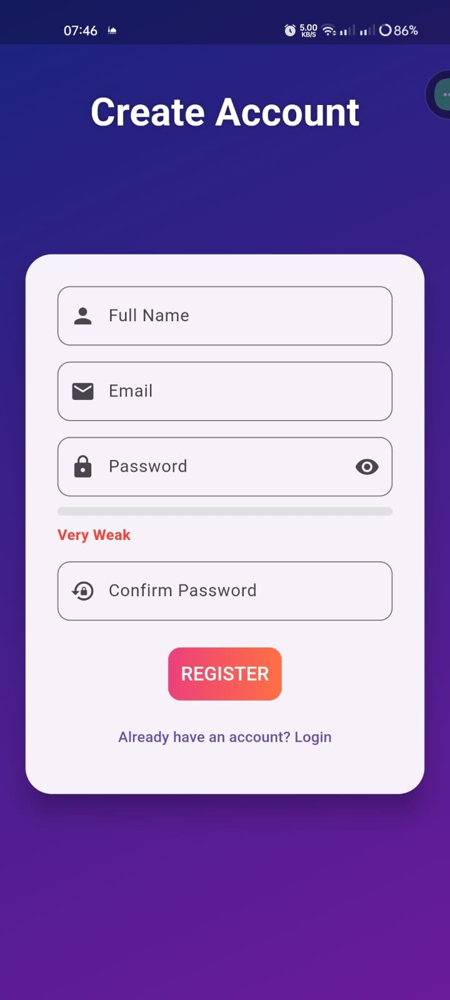

# Flutter Authentication with Supabase

A clean authentication flow implementation using Flutter and Supabase as the backend.

 |  | 
---|---|---

## Features

- User registration with password strength validation
- Email/password login
- Password reset functionality
- Clean, modern UI
- Supabase backend integration

## Tech Stack

- **Frontend**: Flutter
- **Backend**: Supabase (Auth, Database)
- **State Management**: Cubit
- **Form Validation**: manual validation

## Screens

1. **Login Screen**
   - Email input
   - Password input
   - Login button
   - Forgot password link

2. **Registration Screen**
   - Full name input
   - Email input
   - Password input with strength indicator
   - Confirm password field
   - Register button
   - Login link

3. **Password Reset Screen**
   - Email input
   - Reset password button
   - Back to login link

### Setup

1. Clone the repository:
   ```bash
   git clone https://github.com/sayedyounis00/AuthTest.git
